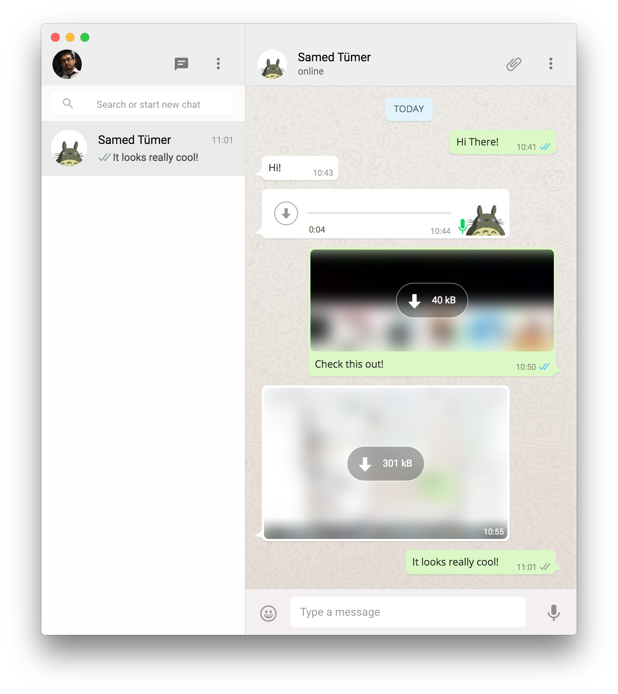
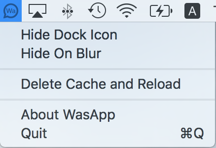
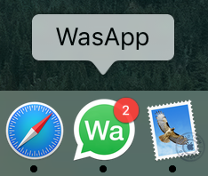

# WasApp - Unofficial WhatsApp for Mac
WasApp is an app uses WhatsApp Web interface on :zap:[Electron](https://electron.atom.io/) framework.

This application is not an official product of WhatsApp. It is just a wrapper for WhatsApp Web interface in a browser.

All communication between the user and WhatsApp servers is handled by official WhatsApp Web App (https://web.whatsapp.com/)

# Download
:floppy_disk: [Latest Release - v1.0.0](https://github.com/tevfik6/WasApp/releases/tag/v1.0.0) 

# Screeshot


# Features
WhatsApp Web has it's own settings. You can use all the preferences. 

#### Settings in Tray Icon on Right Click
* `Hide On Blur` 
* `Hide Dock Icon` 
* `Delete Cache and Reload`



#### Message Counts on Dock



# Know Issues
When window is invisible, nofitication cannot reveal the window.

# Contribution
```sh
# Start on Debug
npm start

# Build
npm run build
```

## Credits
* Programmed by [Tevfik Tümer](http://tevfik.me)
* Icon designed by [Samed Tümer](http://samed.tumblr.com/)